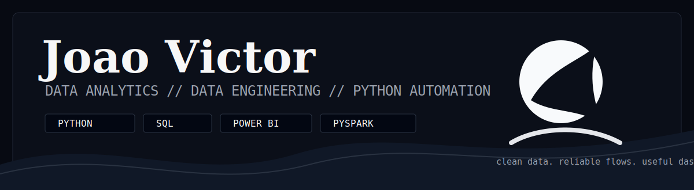
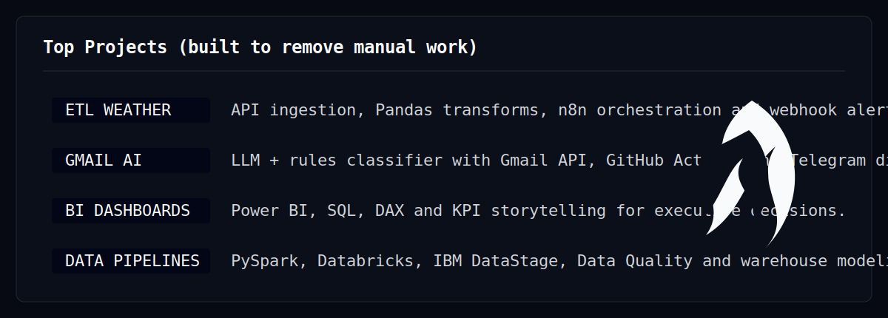
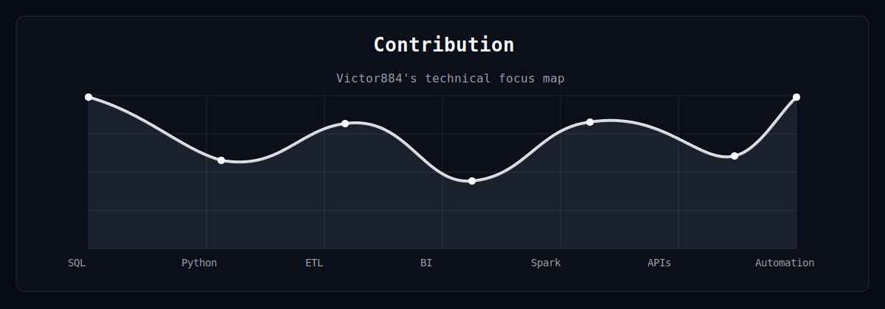

  

  
  
  

  
  
  

---

## Know About Me

<table>
  <tr>
    <td width="38%" valign="top">
      
    </td>
    <td width="62%" valign="top">

Hey there, I'm Joao Victor.

I work at the intersection of data analysis, data engineering and Python development, building practical automations that remove manual work and make information easier to trust.

My background includes financial and educational environments, with experience in ETL/ELT pipelines, BI dashboards, SQL modeling, process automation, APIs, web scraping, RPA and LLM integrations.

The work I like most is direct: collect the data, clean it, model it, automate the boring path and deliver something people can actually use.

    </td>
  </tr>
</table>

---

## Technical Arsenal

  
  
  
  
  
  
  
  
  
  

<table>
  <tr>
    <td width="33%" valign="top">
      <strong>Data Engineering</strong> 
      ETL/ELT, Data Warehouse, Data Lake, Data Quality, PySpark, Databricks, IBM DataStage and Airflow.
    </td>
    <td width="33%" valign="top">
      <strong>Analytics & BI</strong> 
      Power BI, DAX, Power Query, SQL, KPIs, dashboards, storytelling and analytical modeling.
    </td>
    <td width="33%" valign="top">
      <strong>Python Automation</strong> 
      APIs, Selenium, n8n, Power Automate, webhooks, scheduled jobs, LLMs and structured logging.
    </td>
  </tr>
</table>

---

  

## Connect

  
  
  
  

> Code is not finished when it runs. It is finished when the next person can understand it, trust it and change it.

> Good automation is quiet: it handles the routine, logs the important parts and leaves people with better decisions.

---

## GitHub Stats

  
  

  

  

  

---

  
  

  <strong>Automating the repetitive. Modeling the useful. Shipping the reliable.</strong>

